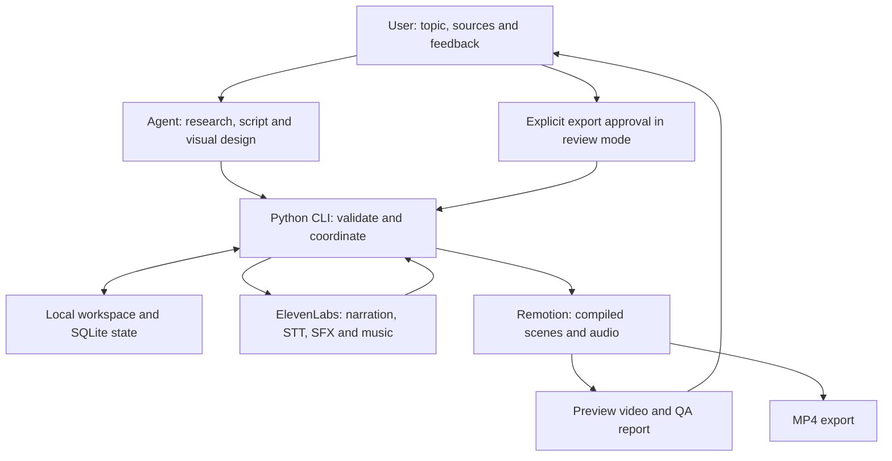

# Vidkit: An Agent-Assisted Workflow for Automated Short-Form Video Production

## 1. Introduction and Objectives

Producing a short video requires more than converting text into speech and placing captions over images. A useful product explainer needs reliable research, a focused script, understandable visuals, accurate timing and clear audio. These tasks are closely connected: changing the narration can invalidate subtitles, while changing a diagram may require different animation timing. Repeated revisions also create practical problems, including misplaced files, unclear approval status and accidental reuse of outdated outputs.

Vidkit addresses these problems through an agent-assisted production workflow. It turns a topic or source URL into a vertical video using structured editorial decisions, tracked media assets and programmatic rendering. Its primary use case is short product and technology explainers, including AI tools and technical concepts. Vietnamese and English content are supported through separate language-specific artifacts within a shared video project.

The project has three objectives. First, automate repeatable operations such as media generation, timeline compilation and rendering. Second, preserve traceability between sources, scripts, assets and outputs. Third, keep creative decisions and final quality assessment visible to a human reviewer. Automation therefore includes explicit handoffs and checks rather than treating every successfully rendered file as a finished video.

Vidkit is a local production toolkit, not a hosted application or an autonomous publishing service. A coding agent works alongside the user, while the software manages execution and state. This division allows the agent to design topic-specific explanations without requiring the Python application to contain its own large language model service.

## 2. System Architecture

The architecture separates editorial reasoning, workflow management, external audio generation and video rendering. An agent such as Codex or Antigravity follows repository skills to research a topic, prepare structured inputs and run CLI commands. Codex is the principal validation environment; the Antigravity guidance describes the same workflow without establishing equivalent end-to-end validation.

Python provides the operational layer. It creates jobs, registers artifacts, validates dependencies, invokes supported services and determines which step remains incomplete. SQLite stores authoritative workflow state. JSON files provide inspectable handoffs, while images, audio, source code and rendered outputs remain in the local workspace. A readable project summary is generated from the recorded state.

| Technology | Responsibility |
| --- | --- |
| Agent skills | Research, script preparation, creative direction and review guidance |
| Python CLI | Job execution, validation, service calls and revision management |
| SQLite and JSON | Persistent state and structured artifact handoffs |
| ElevenLabs APIs | Narration, word-level transcription, sound effects and music |
| React, TypeScript and Remotion | Visual components, frame-based animation, preview and rendering |
| Pillow and Mutagen | Image inspection and audio format/metadata handling |

Remotion supplies the code-based rendering environment, in which React components describe video content. Vidkit passes compiled timing, assets and scene data into that environment. Its standard output is a 1080 × 1920 portrait composition. The approach supports reusable layouts as well as custom visual explanations. [Remotion documentation](https://www.remotion.dev/docs/).

The arrows represent operational handoffs. Approval is enforced by the Python workflow, not by the renderer itself. The source workspace remains the production record; renderer-facing copies are temporary inputs that can be regenerated.

## 3. Video Production Workflow

Production begins with a topic or URL. The agent examines sources, identifies supported claims and proposes an audience-appropriate explanation. Research also establishes which visual evidence is available and how it may be used. If an actual product screenshot cannot be obtained, the workflow can continue with official artwork, a sourced example or an explanatory diagram. The substitute must be identified accurately rather than presented as a captured interface.

The agent then prepares a script and creative brief. The brief describes the narrative angle, theme, hook, expected assets and visual development. An important explanation receives alternative visual approaches before one is selected. Each beat specifies what the viewer should understand, which objects appear, what happens and how the result connects to the next beat. Component selection follows this design work.

Concept review uses representative frames and motion samples. Before narration exists, their timing is provisional. In the default review mode, the user explicitly approves the creative direction before dependent production steps continue. A generic instruction to continue does not grant concept or export approval.

Narration is generated with ElevenLabs Eleven v3. The final MP3 is then submitted to speech-to-text transcription, producing word-level timestamps. Timing is derived from the actual recording rather than guessed from the script. Transcript validation remains necessary because generated speech and recognized words can differ from the intended text. ElevenLabs provides separate speech generation and transcription capabilities. [Text-to-speech documentation](https://elevenlabs.io/docs/overview/capabilities/text-to-speech), [speech-to-text API](https://elevenlabs.io/docs/api-reference/speech-to-text/convert).

Next, the agent prepares assets, a timed storyboard and optional sound design. Scenes and motion cues reference transcript words; Python resolves these anchors into timing. Caption groups can be proposed by the agent or produced by the fallback grouping logic. Narration, music and effects remain separate tracks.

The system creates a preview MP4 and a QA report. Review can lead to changes in visuals, captions, timing or sound. Export in review mode requires approval tied to the current output revision. Automatic mode removes the waiting stages for video approval but retains validation and does not promote library candidates automatically. Neither mode performs automatic YouTube publication.

## 4. Core Features and Implementation

### Workspace, revisions and reproducibility

Each video has a folder named with its creation date, readable title and stable ID. Shared sources and assets sit alongside language-specific scripts, audio, transcripts and storyboards. Preview and export directories make generated files easy to locate. Production data lives in the ignored workspace rather than mixing with version-controlled application code.

Artifacts have revisions, checksums and upstream dependency records. Replacing narration invalidates transcript-based timing. Editing visuals can reuse narration and transcription while requiring a fresh preview and approval. Checkpoints copy relevant code and rendering data; diffs help the agent inspect the current working state before making further changes. Render records preserve input revisions and dependencies. Rebuilding still requires the locked software dependencies and a compatible environment.

### Assets and visual design

Asset manifests record source, description, usage basis, dimensions, actual format and checksum. Import checks distinguish file contents from misleading extensions. Provenance helps explain what a visual represents and where it came from, although recording a usage basis is not an independent legal clearance.

Themes include `dark-grid`, `dark-contours` and `light-editorial`. The component library offers reusable capabilities such as source highlighting, token reveals, branching flows, typed outputs and charts. Remotion Bits examples provide additional references for adaptation; they are not all directly selectable storyboard components.

An agent may reuse, combine or write a new TSX visual. Job-specific packages keep their source, manifest and fixture together, while a generated registry connects them to rendering without product-specific branches in the shared renderer. Shared candidates are tested and previewed before explicit promotion. Approving a video and approving a reusable library component are separate decisions.

### Captions and motion timing

Captions use Noto Sans with Vietnamese support, centered text, a dark outline and accent highlighting. Grouping considers punctuation, pauses, phrase boundaries and measured text width. Explicit caption plans can preserve meaningful phrases and map spoken numbers or units to readable display text. Burned-in captions and SRT/VTT subtitles share the same grouping and timing.

Storyboard motion supports word anchors and dependencies between events. For example, a connector can appear after its source node, followed by the result. Invalid references, circular dependencies and insufficient scene duration are reported. Continuity groups support persistent entities across adjacent scenes, with state calculated from frame position so that scrubbing does not depend on playback history.

### Narration, effects and music

The integration defaults to `eleven_v3` for narration, `scribe_v2` for transcription, `eleven_text_to_sound_v2` for effects and `music_v2_5` for music. Official ElevenLabs Music and Sound Effects skills supply provider guidance; Vidkit adapters retain tracked generation and review rules. Music generation currently uses prompt-based composition with instrumental output by default. [Music composition API](https://elevenlabs.io/docs/api-reference/music/compose), [official ElevenLabs skills](https://github.com/elevenlabs/skills).

Sound plans define gain, trimming, fades, looping and cue placement. Effects can align their audible impact with a word or motion event. Background music uses a transcript-based ducking envelope to lower its level during speech. This is timing-based mixing, not acoustic speech detection or music beat analysis. Studio, audio preview and video rendering consume the compiled mix. Recorded sound-generation requests support reuse and recovery after uncertain responses instead of blind retries.

## 5. Validation, Limitations and Future Development

### Existing validation evidence

The repository's [sound validation report](sound-validation.md), dated September 26, 2026, records 51 passing Python tests. Covered behaviors include API payloads, reuse and recovery, cue alignment, format detection, crossfades, ducking, checksum checks and preservation of narration/transcription. The [visual workflow validation report](v4-validation.md) documents checkpoint and dependency tests, custom TSX integration, motion event ordering and three synthetic rendering jobs: product introduction, mechanism explanation and numerical comparison.

These fixtures exercised actual Remotion output. A separate synthetic audio fixture generated WAV and H.264/AAC MP4 files without paid service calls. Its music measured approximately 10 dB lower during a narration interval, demonstrating the intended ducking behavior. That measurement does not establish musical quality or speech intelligibility.

QA distinguishes automatic checks, frame inspection, transition review, full playback and audio listening. Each check records `pass`, `fail` or `not-run`, with evidence for performed reviews. Silent visual fixtures and synthetic tones validate integration rather than production storytelling. The documented results do not establish improved creativity, shorter review time or audience engagement.

### Current limitations

Studio editability is partial. Computed properties, including volume functions that combine fades and ducking, may be read-only in its interactive controls. Agent changes to code or structured data remain necessary for some adjustments. Automatic DOM overflow inspection is not implemented, and visual clarity, transitions and complete listening still require explicit human or agent inspection evidence.

External services introduce network, account and cost dependencies. Mocked API tests verify request construction but do not establish live account access or generated media quality. Dependency tracking covers supported static imports and declared assets, not arbitrary computed runtime imports. Creative quality depends on research, visual design and review; a component library cannot guarantee an effective explanation.

### Future development

Possible extensions include job-specific Studio controls with persistent edits, broader layout diagnostics and stronger playback review tooling. A production evaluation could measure review time, correction requests and comprehension across several video types. Optional scheduling or publishing could be developed separately. These are future directions, not current capabilities.

## 6. Conclusion and References

Vidkit combines editorial assistance with structured automation for short-form video production. Its contribution is the connection between researched content, creative planning, timed media, reusable or custom visuals and revision-bound review. Python manages execution and traceability, ElevenLabs supplies supported audio services, and Remotion builds the video. Human review remains essential to factual accuracy, understandable visual storytelling and a convincing final mix.

The report describes the implementation inspected on September 27, 2026. Technical evidence comes from repository code and the recorded validation reports, rather than newly generated production results.

### References

- [Project usage and workflow](../README.md).
- [Visual workflow validation](v4-validation.md) and [sound design validation](sound-validation.md).
- [Python documentation](https://docs.python.org/3/) and [SQLite documentation](https://www.sqlite.org/docs.html).
- [React documentation](https://react.dev/learn), [TypeScript documentation](https://www.typescriptlang.org/docs/) and [Remotion documentation](https://www.remotion.dev/docs/).
- [ElevenLabs text-to-speech](https://elevenlabs.io/docs/overview/capabilities/text-to-speech), [speech-to-text API](https://elevenlabs.io/docs/api-reference/speech-to-text/convert) and [music composition API](https://elevenlabs.io/docs/api-reference/music/compose).
- [ElevenLabs skills repository](https://github.com/elevenlabs/skills) and [vendored skill provenance](../.agents/skills/elevenlabs-upstream.md).
